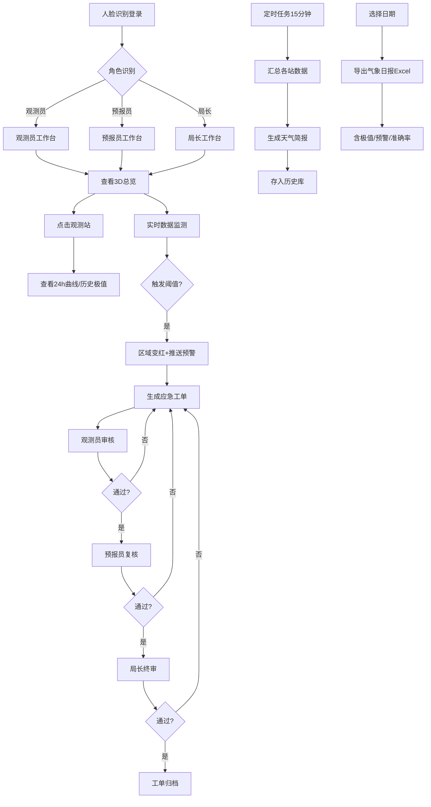

## 1. 产品概述
3D智慧城市气象监测与灾害预警可视化平台，集成气象观测站、雷达站、城市三维模型及预警中心于一体的综合气象管理系统。面向气象部门三级管理角色（观测员、预报员、局长），提供实时气象数据监测、智能预警推送、多级审批流程及历史数据分析等核心功能。

- **核心价值**：通过3D可视化直观呈现城市气象态势，多源数据融合生成精准预报，自动化预警与审批流程提升应急响应效率
- **目标用户**：气象局观测员、预报员、局长及相关应急管理人员
- **解决问题**：传统气象监测平台数据展示抽象、预警响应滞后、审批流程繁琐等痛点

---

## 2. 核心功能

### 2.1 用户角色
| 角色 | 登录方式 | 核心权限 |
|------|----------|----------|
| 观测员 | 人脸识别 | 查看实时数据、审核应急工单、录入观测数据、查看历史简报 |
| 预报员 | 人脸识别 | 复核应急工单、生成/修改预报、查看全量数据、导出日报 |
| 局长 | 人脸识别 | 终审应急工单、全局数据概览、准确率统计、人员管理权限 |

### 2.2 功能模块
1. **登录页面**：人脸识别模拟登录、角色选择、操作日志记录
2. **3D城市总览页**：城市三维模型、观测站分布、雷达站、云层/雨区动态效果、预警区域高亮
3. **观测站详情弹窗**：实时六要素展示、24小时数据曲线、历史极值统计
4. **预报中心页**：3小时动态预报时间轴、云层/雨区扩散动画、预报准确率
5. **预警工单页**：预警列表、工单三级审批流转（观测员审核→预报员复核→局长终审）
6. **天气简报页**：15分钟自动汇总简报、历史简报库、按日期查询
7. **操作日志页**：全量操作记录、按角色/时间筛选
8. **日报导出页**：按日期选择、Excel导出（各站极值、预警次数、准确率）

### 2.3 页面详情
| 页面名称 | 模块名称 | 功能描述 |
|----------|----------|----------|
| 登录页面 | 人脸识别区 | 模拟人脸识别动画、进度条、角色自动识别 |
| 登录页面 | 权限校验 | 三级角色登录态保持、Token管理、登出功能 |
| 3D城市总览 | 城市模型 | 可旋转/缩放城市街区模型、地标建筑高亮 |
| 3D城市总览 | 观测站模型 | 8个观测站分布全市、实时数据悬浮标签、点击进入详情 |
| 3D城市总览 | 雷达站模型 | 2个雷达站、旋转扫描动画、数据回波显示 |
| 3D城市总览 | 云层动画 | 半透明云层漂移、根据预报移动方向和速度变化 |
| 3D城市总览 | 雨区扩散 | 蓝色渐变半透明雨区覆盖、动态扩散收缩效果 |
| 3D城市总览 | 预警高亮 | 风速>6级或能见度<500米时区域模型变红闪烁、声音/弹窗预警 |
| 观测站详情 | 实时数据卡片 | 温度、湿度、气压、风速、风向、能见度六要素实时展示 |
| 观测站详情 | 24小时曲线 | 6组折线图可切换、双轴对比、数据点悬浮提示 |
| 观测站详情 | 历史极值 | 各要素历史最高/最低、出现日期记录 |
| 预报中心 | 预报时间轴 | 3小时分12个时段、拖动时间轴查看各时点预报 |
| 预报中心 | 预报要素 | 各时段温湿度、降水概率、风速风向、能见度预报 |
| 预警工单 | 工单列表 | 待审核/待复核/待终审/已完成四状态Tab切换 |
| 预警工单 | 审批流转 | 观测员审核→预报员复核→局长终审，每级可填写审批意见、退回、通过 |
| 预警工单 | 表单校验 | 发布预警前校验信息完整性、无效输入明确错误提示 |
| 天气简报 | 自动生成 | 每15分钟自动汇总8站数据生成简报、存入历史库 |
| 天气简报 | 历史查询 | 按日期范围查询历史简报、简报详情查看 |
| 操作日志 | 日志列表 | 登录/登出、数据操作、审批操作全记录 |
| 操作日志 | 筛选功能 | 按角色、操作类型、时间范围筛选 |
| 日报导出 | 日期选择 | 支持单日/日期范围选择 |
| 日报导出 | Excel生成 | 含各站日极值、当日预警次数统计、预报准确率计算 |

---

## 3. 核心流程

### 3.1 登录流程
用户打开系统 → 进入人脸识别界面 → 选择角色进行模拟识别 → 识别成功后跳转至对应权限的3D总览页 → 记录登录操作日志

### 3.2 预警生成与审批流程
多源数据采集 → 系统判定触发阈值（风速>6级 或 能见度<500米）→ 3D场景区域变红 + 自动推送预警 → 生成应急响应工单 → 观测员审核 → 预报员复核 → 局长终审 → 工单归档

### 3.3 天气简报生成流程
定时任务（每15分钟触发）→ 采集8个观测站当前数据 → 计算区域均值、极值 → 生成标准格式天气简报 → 存入历史简报库

### 3.4 Mermaid流程图

---

## 4. 用户界面设计

### 4.1 设计风格
- **主色调**：深空蓝 `#0A1628`（背景）、科技青 `#00D4FF`（主强调）、预警红 `#FF4757`（警告）、数据绿 `#2ED573`（正常）
- **辅助色**：云层白 `rgba(255,255,255,0.6)`、雨区蓝 `rgba(30,144,255,0.3)`、紫色 `#7B68EE`（雷达）
- **按钮风格**：玻璃拟态（Glassmorphism）、发光描边、圆角8px、hover时亮度增强+外发光
- **字体**：标题使用 `Orbitron`（科技感）、正文使用 `Noto Sans SC`（中文可读性）
- **布局风格**：左侧侧边栏导航 + 主内容3D场景 + 右侧数据面板、卡片悬浮玻璃拟态效果
- **图标**：使用 Lucide React 图标库，配合自定义SVG气象图标

### 4.2 页面设计概览
| 页面名称 | 模块名称 | UI元素 |
|----------|----------|--------|
| 登录页面 | 人脸识别 | 全屏深空背景、扫描线动画、圆形人脸框、科技感发光边框、角色选择下拉 |
| 3D总览页 | 3D场景 | Canvas全屏、顶部状态栏（时间/预警数/在线用户）、左侧导航栏、右侧数据面板、底部时间轴 |
| 3D总览页 | 观测站标签 | 悬浮数据气泡、六要素迷你图标、预警时红色脉冲动画 |
| 观测站详情 | 弹窗 | 居中大弹窗、左侧实时卡片网格、右侧Tab切换（曲线/极值）、关闭按钮发光 |
| 观测站详情 | 曲线图表 | ECharts折线图、渐变填充、多系列切换、Tooltip格式化 |
| 预警工单页 | 列表 | 状态Tab、卡片式工单、审批状态进度条、三级人员头像 |
| 预警工单页 | 审批模态框 | 审批意见富文本、校验提示红色文字、通过/退回按钮组 |
| 日报导出页 | 导出界面 | 日期范围选择器、导出预览表、Excel下载按钮、加载进度 |

### 4.3 响应式设计
- **Desktop优先**：默认1920×1080分辨率设计
- **平板适配**：≥1280px，侧边栏可折叠、右侧面板变为底部面板
- **触控优化**：3D场景支持手势旋转缩放、按钮最小44px触控区域

### 4.4 3D场景指导
- **环境氛围**：城市夜景风格，深蓝色天空配繁星HDR、地平面辉光
- **灯光设置**：平行月光（冷白色）+ 城市点光源暖黄色 + 观测站LED发光材质
- **相机设置**：初始45°俯视角、OrbitControls控制、限制最小/最大缩放距离
- **构图焦点**：城市中心为主视点、观测站围绕环形分布、雷达站位于对角
- **交互动画**：建筑hover发光、观测站点击弹起效果、云层循环漂移、雨区Shader动画
- **后处理效果**：Bloom泛光、轻微Vignette暗角、FXAA抗锯齿
- **性能预算**：总面数<10万、Draw Call<50、InstancedMesh渲染建筑群

---

## 5. 非功能性需求
### 5.1 性能要求
- 3D场景FPS≥60（中端显卡）
- 页面首屏加载≤3秒
- 数据更新延迟≤1秒
- Excel导出≤2秒生成

### 5.2 数据要求
- 所有数据使用Mock模拟，结构真实
- 数据更新间隔：实时数据5秒刷新、定时任务15分钟
- 操作日志永久存储于localStorage

### 5.3 安全要求
- 前端路由权限守卫
- 审批操作需二次确认
- 表单输入XSS过滤
