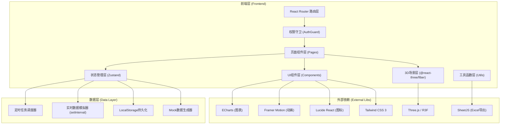

## 1. 架构设计



---

## 2. 技术描述

### 2.1 核心技术栈
| 类别 | 技术选型 | 版本 | 用途 |
|------|----------|------|------|
| 构建工具 | Vite | ^5.0.0 | 快速构建、HMR热更新 |
| 框架 | React | ^18.2.0 | UI组件化开发 |
| 语言 | TypeScript | ^5.3.0 | 类型安全 |
| 样式 | Tailwind CSS | ^3.4.0 | 原子化CSS |
| 状态管理 | Zustand | ^4.4.0 | 轻量全局状态 |
| 3D引擎 | Three.js | ^0.160.0 | WebGL 3D渲染 |
| 3D React封装 | @react-three/fiber | ^8.15.0 | React方式写Three.js |
| 3D工具库 | @react-three/drei | ^9.92.0 | 预置3D组件/Controls |
| 3D后处理 | @react-three/postprocessing | ^2.15.0 | Bloom/暗角等效果 |
| 图表 | ECharts | ^5.4.0 + echarts-for-react | 24h数据曲线 |
| Excel导出 | SheetJS (xlsx) | ^0.18.5 | 气象日报Excel导出 |
| 图标 | Lucide React | ^0.300.0 | 高质量SVG图标 |
| 动画 | Framer Motion | ^10.17.0 | UI过渡/微交互 |

### 2.2 初始化方式
```bash
npm create vite@latest . -- --template react-ts
```

---

## 3. 路由定义

| 路由路径 | 页面组件 | 权限要求 | 说明 |
|----------|----------|----------|------|
| `/login` | `LoginPage` | 公开 | 人脸识别登录页 |
| `/` | `DashboardPage` | 全部角色 | 3D城市总览主页 |
| `/forecast` | `ForecastPage` | 全部角色 | 3小时动态预报中心 |
| `/workorders` | `WorkOrderPage` | 全部角色 | 预警工单审批列表 |
| `/briefings` | `BriefingPage` | 全部角色 | 天气简报历史库 |
| `/logs` | `LogPage` | 局长/预报员 | 操作日志查询 |
| `/export` | `ExportPage` | 预报员/局长 | 气象日报Excel导出 |
| `*` | `NotFoundPage` | 公开 | 404页面 |

---

## 4. 核心数据类型定义 (TypeScript)

```typescript
// ===== 用户与权限 =====
type UserRole = 'observer' | 'forecaster' | 'director';

interface User {
  id: string;
  name: string;
  role: UserRole;
  avatar: string;
  faceId: string;
  token: string;
  loginAt: number;
}

interface OperationLog {
  id: string;
  userId: string;
  userName: string;
  role: UserRole;
  action: string;
  target: string;
  detail: string;
  ip: string;
  timestamp: number;
}

// ===== 气象观测站 =====
interface WeatherStation {
  id: string;
  name: string;
  district: string;
  position: [number, number, number]; // 3D坐标 x,y,z
  color: string;
}

interface RealtimeWeather {
  stationId: string;
  timestamp: number;
  temperature: number;      // °C
  humidity: number;         // %
  pressure: number;         // hPa
  windSpeed: number;        // m/s
  windDirection: number;    // 0-360°
  visibility: number;       // 米
}

interface HourlyData {
  time: string;             // HH:mm
  temperature: number;
  humidity: number;
  pressure: number;
  windSpeed: number;
  windDirection: number;
  visibility: number;
}

interface HistoryExtreme {
  type: 'temperature' | 'humidity' | 'pressure' | 'windSpeed' | 'visibility';
  max: number;
  maxDate: string;
  min: number;
  minDate: string;
}

// ===== 雷达站 =====
interface RadarStation {
  id: string;
  name: string;
  position: [number, number, number];
  rotationSpeed: number;
}

// ===== 预报 =====
interface ForecastSlot {
  time: string;             // HH:mm
  temperature: number;
  humidity: number;
  precipitation: number;    // %概率
  windSpeed: number;
  windDirection: number;
  visibility: number;
  cloudCover: number;       // 0-100%
  rainArea: { x: number; z: number; radius: number } | null;
}

interface Forecast3H {
  generatedAt: number;
  slots: ForecastSlot[];    // 12个时段，每15分钟
  accuracy: number;         // %
}

// ===== 预警与工单 =====
type AlertLevel = 'normal' | 'warning' | 'danger';
type AlertType = 'wind' | 'visibility' | 'both';
type WorkOrderStatus = 'pending_observer' | 'pending_forecaster' | 'pending_director' | 'approved' | 'rejected';

interface WeatherAlert {
  id: string;
  stationId: string;
  type: AlertType;
  level: AlertLevel;
  message: string;
  windSpeed?: number;
  visibility?: number;
  triggeredAt: number;
  areaPosition: [number, number, number];
  areaRadius: number;
}

interface ApprovalRecord {
  id: string;
  approverId: string;
  approverName: string;
  approverRole: UserRole;
  action: 'approve' | 'reject';
  opinion: string;
  timestamp: number;
}

interface WorkOrder {
  id: string;
  alertId: string;
  title: string;
  description: string;
  status: WorkOrderStatus;
  currentStep: number;      // 1=观测员, 2=预报员, 3=局长
  alerts: WeatherAlert[];
  approvals: ApprovalRecord[];
  createdAt: number;
  closedAt?: number;
}

interface FormValidationResult {
  valid: boolean;
  errors: Record<string, string>;
}

// ===== 天气简报 =====
interface WeatherBriefing {
  id: string;
  generatedAt: number;      // 时间戳
  period: string;           // "HH:mm-HH:mm"
  summary: string;
  avgTemperature: number;
  avgHumidity: number;
  avgPressure: number;
  maxWindSpeed: number;
  minVisibility: number;
  stationData: {
    stationId: string;
    stationName: string;
    temperature: number;
    humidity: number;
    windSpeed: number;
    visibility: number;
  }[];
  activeAlerts: number;
}

// ===== 日报导出 =====
interface DailyReport {
  date: string;             // YYYY-MM-DD
  stations: {
    stationId: string;
    stationName: string;
    maxTemp: number;
    minTemp: number;
    maxHumidity: number;
    minHumidity: number;
    maxWind: number;
    minVisibility: number;
  }[];
  alertCount: number;
  alertDetails: {
    time: string;
    station: string;
    type: string;
    level: string;
  }[];
  forecastAccuracy: number;
}
```

---

## 5. Zustand Store 设计

```typescript
// store/index.ts
interface AppState {
  // 用户态
  user: User | null;
  isAuthenticated: boolean;
  
  // 气象数据
  stations: WeatherStation[];
  radars: RadarStation[];
  realtimeData: Record<string, RealtimeWeather>;  // key: stationId
  hourlyData: Record<string, HourlyData[]>;        // key: stationId
  extremeData: Record<string, HistoryExtreme[]>;   // key: stationId
  
  // 预报
  forecast: Forecast3H | null;
  forecastTimeIndex: number;  // 当前查看的预报时段索引 0-11
  
  // 预警与工单
  activeAlerts: WeatherAlert[];
  workOrders: WorkOrder[];
  
  // 简报
  briefings: WeatherBriefing[];
  
  // 日志
  operationLogs: OperationLog[];
  
  // UI状态
  selectedStationId: string | null;
  isStationModalOpen: boolean;
  isAlertNotification: boolean;
  
  // Actions
  login: (role: UserRole) => Promise<void>;
  logout: () => void;
  refreshRealtimeData: () => void;
  selectStation: (id: string | null) => void;
  createAlert: (alert: WeatherAlert) => void;
  approveWorkOrder: (orderId: string, opinion: string) => FormValidationResult;
  rejectWorkOrder: (orderId: string, opinion: string) => FormValidationResult;
  generateBriefing: () => void;
  exportDailyReport: (date: string) => Blob;
  addLog: (action: string, target: string, detail: string) => void;
}
```

---

## 6. 项目目录结构

```
src/
├── assets/                  # 静态资源
│   ├── fonts/               # Orbitron / Noto Sans SC
│   ├── icons/               # 自定义SVG气象图标
│   └── images/              # 纹理贴图/占位图
├── components/
│   ├── auth/                # 登录相关
│   │   ├── FaceScan.tsx     # 人脸识别动画
│   │   └── RoleSelector.tsx
│   ├── layout/              # 布局组件
│   │   ├── Sidebar.tsx
│   │   ├── TopBar.tsx
│   │   └── DataPanel.tsx
│   ├── 3d/                  # 3D场景组件
│   │   ├── Scene.tsx
│   │   ├── CityModel.tsx
│   │   ├── StationMarker.tsx
│   │   ├── RadarDish.tsx
│   │   ├── CloudLayer.tsx
│   │   ├── RainArea.tsx
│   │   └── AlertZone.tsx
│   ├── weather/             # 气象数据组件
│   │   ├── RealtimeCard.tsx
│   │   ├── StationModal.tsx
│   │   ├── TrendChart.tsx
│   │   └── ExtremeTable.tsx
│   ├── forecast/            # 预报组件
│   │   ├── ForecastTimeline.tsx
│   │   └── ForecastGrid.tsx
│   ├── workorder/           # 工单组件
│   │   ├── WorkOrderCard.tsx
│   │   ├── WorkOrderList.tsx
│   │   ├── ApprovalModal.tsx
│   │   └── StepIndicator.tsx
│   ├── briefing/
│   │   ├── BriefingCard.tsx
│   │   └── BriefingDetail.tsx
│   ├── logs/
│   │   └── LogTable.tsx
│   ├── export/
│   │   ├── DateRangePicker.tsx
│   │   └── ExportPreview.tsx
│   └── common/              # 通用组件
│       ├── GlassCard.tsx
│       ├── GlowButton.tsx
│       ├── StatusBadge.tsx
│       └── AlertToast.tsx
├── pages/                   # 路由页面
│   ├── LoginPage.tsx
│   ├── DashboardPage.tsx
│   ├── ForecastPage.tsx
│   ├── WorkOrderPage.tsx
│   ├── BriefingPage.tsx
│   ├── LogPage.tsx
│   ├── ExportPage.tsx
│   └── NotFoundPage.tsx
├── store/                   # Zustand状态
│   ├── index.ts
│   ├── authStore.ts
│   ├── weatherStore.ts
│   ├── workOrderStore.ts
│   └── logStore.ts
├── utils/
│   ├── mock.ts              # Mock数据生成器
│   ├── excel.ts             # Excel导出工具
│   ├── validation.ts        # 表单校验工具
│   ├── constants.ts         # 常量/阈值配置
│   ├── formatters.ts        # 数字/日期格式化
│   └── storage.ts           # LocalStorage封装
├── hooks/
│   ├── useAuthGuard.ts      # 路由权限守卫
│   ├── useInterval.ts       # 定时器Hook
│   ├── useRealtimeData.ts   # 实时数据Hook
│   └── useScheduler.ts      # 定时任务Hook
├── routes/
│   └── index.tsx            # 路由配置
├── styles/
│   ├── globals.css          # Tailwind入口/全局样式
│   └── animations.css       # 自定义动画keyframes
├── types/
│   └── index.ts             # 全局类型定义
├── App.tsx
├── main.tsx
└── vite-env.d.ts
```

---

## 7. 关键业务规则实现

### 7.1 预警触发阈值
```typescript
// utils/constants.ts
export const ALERT_THRESHOLDS = {
  WIND_LEVEL_6: 10.8,      // m/s, 六级风起始
  VISIBILITY_LOW: 500,     // 米
};

// 预警判定逻辑
function checkAlert(data: RealtimeWeather): WeatherAlert | null {
  const isWindAlert = data.windSpeed >= ALERT_THRESHOLDS.WIND_LEVEL_6;
  const isVisAlert = data.visibility <= ALERT_THRESHOLDS.VISIBILITY_LOW;
  
  if (!isWindAlert && !isVisAlert) return null;
  
  return {
    type: isWindAlert && isVisAlert ? 'both' : isWindAlert ? 'wind' : 'visibility',
    level: (isWindAlert && isVisAlert) ? 'danger' : 'warning',
    // ...其余字段
  };
}
```

### 7.2 工单审批流转
```typescript
const APPROVAL_FLOW: Record<UserRole, { next: WorkOrderStatus; step: number }> = {
  observer:     { next: 'pending_forecaster', step: 1 },
  forecaster:   { next: 'pending_director',   step: 2 },
  director:     { next: 'approved',           step: 3 },
};
```

### 7.3 表单校验规则
```typescript
// utils/validation.ts
function validateWorkOrderSubmission(data: {
  title: string;
  description: string;
  opinion: string;
}): FormValidationResult {
  const errors: Record<string, string> = {};
  if (!data.title?.trim()) errors.title = '预警标题不能为空';
  if (data.title?.length > 100) errors.title = '标题长度不能超过100字符';
  if (!data.description?.trim()) errors.description = '预警描述不能为空';
  if (!data.opinion?.trim()) errors.opinion = '审批意见不能为空';
  if (data.opinion?.length < 5) errors.opinion = '审批意见至少5个字符';
  return { valid: Object.keys(errors).length === 0, errors };
}
```

---

## 8. 定时任务调度

| 任务 | 间隔 | 执行内容 |
|------|------|----------|
| 实时数据刷新 | 5秒 | 更新所有观测站实时六要素数据、检查阈值触发预警 |
| 云层/雨区动画 | 每帧 | requestAnimationFrame驱动云层位置、雨区Shader uniforms更新 |
| 天气简报生成 | 15分钟 | 汇总数据生成标准简报、写入历史库、记录操作日志 |
| 预报准确率更新 | 30分钟 | 对比预报与实际、更新准确率指标 |

---

## 9. 性能优化策略

1. **3D场景优化**：
   - 建筑群使用 `InstancedMesh` 批量渲染
   - 材质共享、纹理压缩
   - LOD (Level of Detail) 远景建筑降面

2. **数据层优化**：
   - Zustand 状态切片 + selector 避免无关重渲染
   - 图表数据 useMemo 缓存
   - LocalStorage 读写节流

3. **打包优化**：
   - Three.js 按需引入 (tree-shaking)
   - ECharts 按需引入折线图组件
   - 代码分割按路由拆分 chunk
